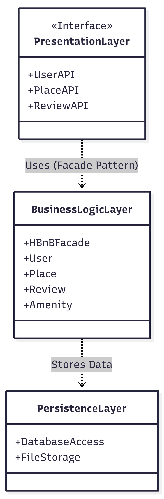
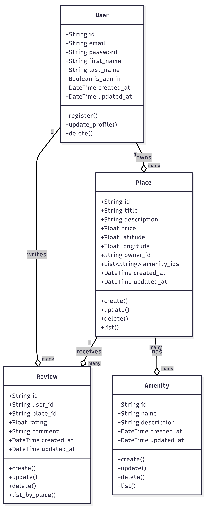
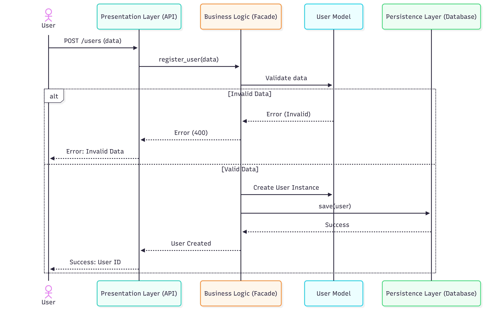
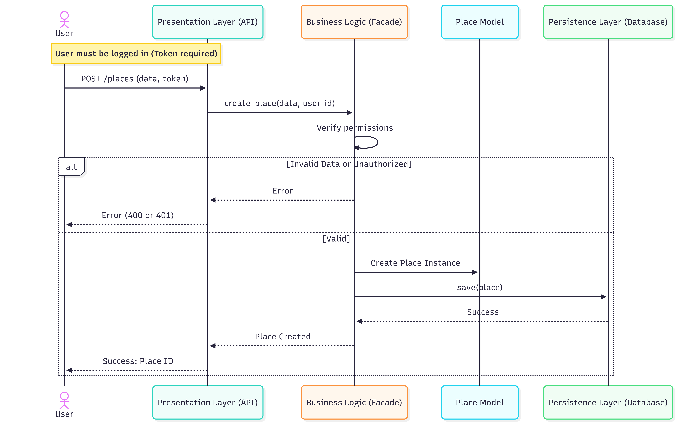
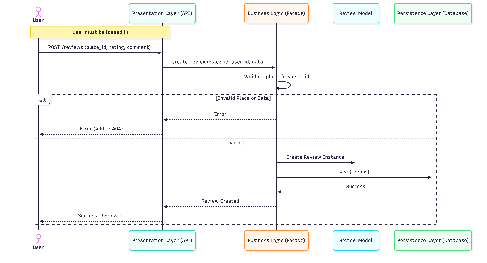
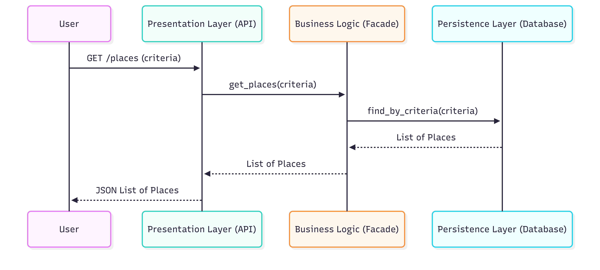

# HBnB Project - Technical Documentation

## 1. Introduction
This document serves as a comprehensive technical blueprint for the HBnB project, a clone of the AirBnB application. Its purpose is to guide the implementation phases by providing a clear reference for the system’s architecture, business logic, and API interactions. It aggregates the high-level architectural decisions, the data model design, and the sequence of operations for key functionalities.

## 2. High-Level Architecture
The application follows a **3-Tier Architecture** to ensure separation of concerns, scalability, and maintainability.

### Explanatory Notes
* **Presentation Layer (Services & API):** This is the entry point of the application. It handles HTTP requests from users (via a web frontend or API client). It interacts with the Business Logic Layer exclusively through the Facade interface.
* **Business Logic Layer (The Core):** This layer contains the intelligence of the application. It includes the Entities (User, Place, etc.) and the **HBnBFacade**. The Facade pattern is used to simplify the interface for the Presentation layer, hiding the complexity of the underlying models and storage mechanisms.
* **Persistence Layer (Data Storage):** This layer handles the saving and retrieving of data. Whether storing in JSON files or a Database, this layer ensures data durability. The Business Logic layer communicates with this layer to persist objects.

## 3. Business Logic Layer
The core of the application is built around specific entities that represent the business domain.

### Explanatory Notes
* **Entities:**
    * **User:** Represents the actors in the system. Includes authentication data (email/password) and administrative status.
    * **Place:** Represents the properties available for rent. It is the central entity linking Owners (Users) and Amenities.
    * **Review:** Represents feedback provided by a User about a Place.
    * **Amenity:** Represents features (Wifi, Pool, etc.) associated with a Place.
* **Relationships:**
    * **User ↔ Place:** A One-to-Many relationship (A user can own multiple places).
    * **Place ↔ Review:** A One-to-Many relationship (A place can have multiple reviews).
    * **Place ↔ Amenity:** A Many-to-Many relationship (A place has many amenities; an amenity exists in many places).

## 4. API Interaction Flow
The following sequence diagrams illustrate how the system components interact to fulfill specific user requests.

### 4.1. User Registration
**Scenario:** A new user signs up.

* **Flow:** The API receives the data and passes it to the Facade. The Facade validates the uniqueness of the email. If valid, a new User object is created and saved to the Persistence layer.

### 4.2. Place Creation
**Scenario:** A logged-in user creates a new listing.

* **Flow:** This action requires authentication (Token). The Facade verifies the user's identity before creating the Place object. The Place is then linked to the `owner_id` and saved.

### 4.3. Review Submission
**Scenario:** A user posts a review for a place.

* **Flow:** The system validates that both the `user_id` (reviewer) and `place_id` (target) exist. If confirmed, the Review is created and stored.

### 4.4. Fetching Places
**Scenario:** A user requests a list of places based on criteria.

* **Flow:** The Facade receives the criteria (filters), queries the Persistence layer for matching records, and returns the list to the API for display.

